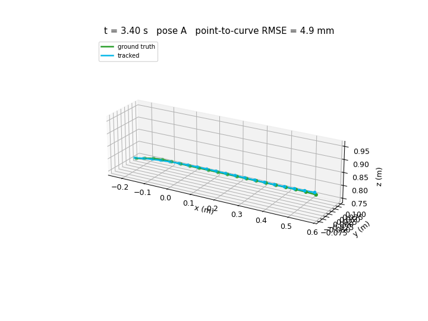

# Closed-Loop Camera Control for DLO Perception

A MuJoCo simulation for studying how an **actively moved camera** can track the shape and movement of a
**deformable linear object (DLO)**, such as a cable, while other robots
handle it.

Three UFactory Lite 6 arms stand on a 60 in × 30 in workstation:

- **r1** carries a wrist-mounted Intel RealSense D435i and moves on a rail. It is the perception arm.
- **r2** grabs the cable's left end and carries it through a series of waypoints.
- **r3** grabs the cable's right end at the same time and carries it to a fixed hold position.

While r2 and r3 move the cable, r1 moves its camera through several viewpoints
(Pose A → B → C) and records RGB-D frames. [TrackDLO](https://github.com/RMDLO/trackdlo)
(CPD-LLE registration, run through ROS Noetic) estimates the cable's 3D node
positions. The project compares those estimates with the simulator's ground truth,
studies why tracking fails (occlusion by the grippers, grazing viewing angles,
marker-colored blind spots, solver breakdown) and builds a failure predictor. That
predictor is the input for a next-best-view (NBV) camera planner.



*Chained A→B→C run: tracked cable (TrackDLO) vs. MuJoCo ground truth.*
An interactive 3D version is in [`stitch_3d_gt_vs_tracked_chained_tvis012.html`](stitch_3d_gt_vs_tracked_chained_tvis012.html),
and a screen recording of the V4 scene is in [`V4.webm`](V4.webm).

## Pipeline

1. **Scene generation**: `mujoco_scenes/generate_triple_scene_v*.py` builds the three-arm
   workcell, the cable (a chain of rigid segments), the fixture and box, and a custom grasp tool that fits in the gripper jaws.
   The generated XMLs are in `Scene Xmls/`.
2. **Manipulation and camera choreography**: `run_dlo_v{4,5}_freeze.py` runs the
   dual-arm cable task (`dlo_route_v*_freeze.py`) while r1 follows its camera schedule
   (`r1_camera_ik*.py`). During each pose hold, it saves 30 Hz RGB + depth frames, camera poses and intrinsics.
3. **Rendering and sensor model**: `rendering/` renders RGB-D, applies a D435 depth-noise
   model, and builds cable masks and point clouds.
4. **Ground truth**: `ground_truth/` records cable node positions, camera extrinsics, and
   ray-cast occlusion labels for each node (`VISIBLE` / `OCCLUDED` / `OUT_OF_FRAME`).
5. **Tracking**: `trackdlo_eval/run_r1_tracking*.py` replays the captures into TrackDLO
   offline. `r1_live_tracking_bridge*.py` publishes frames to ROS live while the sim runs.
   `bridge_transit_gaps*.py` fills the camera-transit blackouts using the grippers' kinematics (FK).
6. **Evaluation**: `trackdlo_eval/evaluate_v5.py` reports point-to-curve and per-node
   error, grouped by occlusion label. The `stitch_3d_*` scripts produce the overlays above.
7. **Multi-view triangulation**: `gt_correspondence.py` and `triangulate.py`
   match the 2D centerlines extracted from each pose to GT nodes and triangulate them. Results are in
   `r1_2d_shape_extraction/`, `r1_gt_correspondence/` and `r1_triangulation/`.
8. **Failure prediction** (`algorithm/`):
   - `build_predictor_dataset.py`: joins tracker diagnostics, ground truth and mask support into one feature table per frame
   - `label_failures.py`: labels each node's failure episodes with hysteresis (sim-only label)
   - `classify_risk.py`: gives a risk score and failure class for each frame, using only signals available live
   - `estimate_time_to_divergence.py`: estimates the lead time from a risk flag to failure
   - `compare_fk_occlusion_classification.py`: occlusion computed from FK only vs. ground-truth occlusion

   `algorithm/Algorithm_Plan` describes the failure taxonomy, the logging plan and the
   inputs, outputs and objective of the NBV planner.

## Scene versions

| Version | Difference |
|---|---|
| **V4** | r1 moves along its rail between the three camera poses. |
| **V5** | Shorter cable and box. r1 stays at one rail position. Adds the grasp-tool mesh, `--ros-live` and `--nbv` (camera holds that end when a gripper stays hidden). |

## Repository layout

```
algorithm/                  failure-predictor build + NBV design notes
ground_truth/               GT cable nodes, camera extrinsics, occlusion labels
mujoco_scenes/              scene generators (v2–v5, calibration scene)
rendering/                  RGB-D rendering, D435 noise, masks, point clouds
Scene Xmls/                 generated MuJoCo scene XMLs (v4, v5)
tools/                      download Lite 6 / D435i models from mujoco_menagerie
trackdlo_eval/              offline tracking, gap bridging, evaluation, 3D overlays
trajectories and tracking/  arm planners, r1 camera IK/capture, live ROS bridge
r1_*/                       saved triangulation-study outputs
IMAGES/                     scene and grasp screenshots
run_dlo_v4_freeze.py        V4 entry point
run_dlo_v5_freeze.py        V5 entry point
```

## Setup

Requirements: Python 3.10+, `mujoco`, `numpy`, `opencv-python`, `Pillow`. Live
tracking also needs ROS Noetic, `rospy` and a built TrackDLO workspace.

Download the robot and camera models (saved under `vendor/mujoco_menagerie/`):

```bash
python tools/download_menagerie_lite6.py
python tools/download_menagerie_d435i.py
```

> **Note:** this repo is a snapshot of the lab workspace. Some scripts import from
> `trajectories/` (named `trajectories and tracking/` here), write to a `results/`
> directory, and expect the grasp-tool STL at the repo root. You may need to adjust those paths
> before scripts run outside the lab setup.

## Running

```bash
python run_dlo_v5_freeze.py              # headless: r1 eye-in-hand capture
python run_dlo_v5_freeze.py --view       # with a live MuJoCo viewer
python run_dlo_v5_freeze.py --ros-live   # also stream frames to TrackDLO (ros_noetic env)
python run_dlo_v5_freeze.py --nbv        # variable-duration holds driven by gripper visibility
```

On the lab Linux station:

```bash
cd gerry_DLO
/home/nasta/miniconda3/bin/conda run -n ros_noetic python3 run_dlo_v5_freeze.py          # headless
/home/nasta/miniconda3/bin/conda run -n ros_noetic python3 run_dlo_v5_freeze.py --view   # viewer
```

Evaluate a tracking run:

```bash
python trackdlo_eval/evaluate_v5.py --chained    # A→B→C combined run
python trackdlo_eval/evaluate_v5.py --bridged    # plus transit-gap bridging
```
